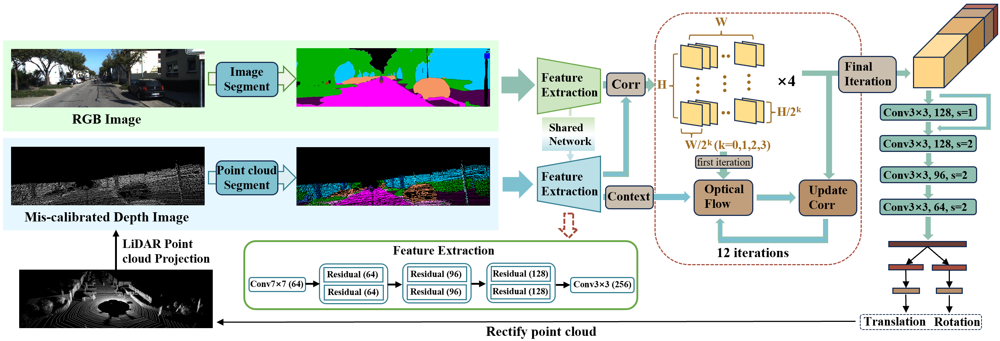

# MSSNet: LiDAR-Camera Extrinsic Calibration Based on Multi-Modal Semantic Similarity

Chao Xu, Yadong Wang, Jinying Zhang, Yaohui Zhu, Tianyu Shen\*, Kunfeng Wang*

(*Corresponding authors)

## Framework Overview

This paper proposes a LiDAR-camera extrinsic calibration method leveraging multi-modal semantic similarity (MSSNet) from pointcloud and image data. Specifically, the multi-modal semantic information is exploited as input to calculate the similarity between images and point clouds using correlation volume, which is updated with an optical flow estimation module. Then the calibration parameters are regressed using the final updated correlation volume. 



## Install

### Requirements
- python 3.6
- PyTorch==1.0.1.post2
- Torchvision==0.2.2
- [`mathutils`](https://gitlab.com/m1lhaus/blender-mathutils.git)
- sacred==0.7.4
- opencv-python
- numpy
- pykitti

### Data Preparation

Download dataset from [`KITTI odometry dataset`](https://www.cvlibs.net/datasets/kitti/eval_odometry.php)

### Run mseg for image segmentation

Install the `mseg` module from [`mseg-api`](https://github.com/mseg-dataset/mseg-api).

Replace file mseg_semantic/tool/mseg/utils/fb_colormap.py

### Run PVKD for point cloud segmentation

Install the `PVKD` module from [`PVKD`](https://github.com/cardwing/Codes-for-PVKD.git)

### Data file directory

```
./
├── train.py
├── ...
└── data/
    ├──sequences
        ├── 00/ 
        │   ├── velodyne/	
        |   |	├── 000000.bin
        |   |	└── ...
        │   ├── image_2/	
        |   |	├── 000000.png
        |   |	└── ...
        │   ├── semantic_image/	
        |   |	├── 000000.png
        |   |	└── ...
        │   └── predictions/ 
        |   |	├── 000000.label
        |   |	└── ...
        │   ├── calib.txt
        │   ├── times.txt
        ├── 01/
	    └── ...
        └── 21/
```

## Run

### Train

1. You can change the path of the dataset in `train.py`.

```
data_folder = 'your_data_folder/'
```

2. Set your GPU ID and use BalancedDataParallel to allocate batch_size to the GPU

```
os.environ['CUDA_VISIBLE_DEVICES'] = '0, 1, 2'
model = BalancedDataParallel(16, model, device_ids=[0, 1, 2])
```

3. Train

```commandline
python train.py
```

### Pre-trained models

Download the [pre-trained models](https://pan.baidu.com/s/17Ekxu3q6HBSIU9SrelWlrw?pwd=mssn) and put them in `./checkpoints`.

## Pubulication

This paper is currently being submitted.

## Contact Us

If you have any problem about this work, please feel free to reach us out at `2021200740@buct.edu.cn`.